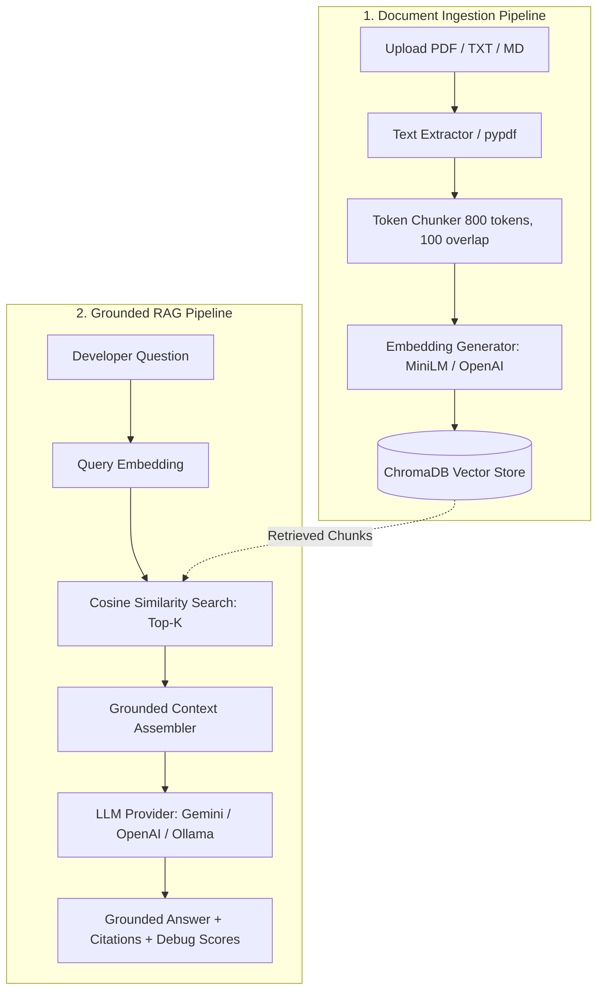

# 🛡️ Aegis — AI Engineering Knowledge & Incident Intelligence Platform

[](https://fastapi.tiangolo.com)
[](https://react.dev)
[](https://www.typescriptlang.org)
[](https://www.trychroma.com)
[](LICENSE)

Aegis is a production-grade AI engineering knowledge platform engineered to provide verifiable, hallucination-resistant answers from technical documentation, architecture decision records (ADRs), and incident runbooks.

---

## 📌 Problem Statement

Engineering teams spend hours navigating fragmented technical documentation across PDFs, incident post-mortems, system designs, and codebases:
- **Information Overload**: Locating specific database schemas, API specs, or runbook procedures creates developer cognitive fatigue.
- **Hallucinations in Generic AI**: Standard LLMs lack private system context and confidently hallucinate incorrect configurations or outdated architectural details.
- **Lack of Provenance**: Developers cannot trust AI answers without knowing the exact source file and page number.

**Aegis solves this** by pairing token-aware chunking and local vector embeddings with grounded prompt constraints, exact source citations, and retrieval transparency.

---

## ✅ Phase 1: Implemented Features

### 📄 1. Multi-Format Ingestion Engine
- **Supported Formats**: Ingests PDF (`.pdf`), plain text (`.txt`), and Markdown (`.md`).
- **Page-Preserved Extraction**: Uses `pypdf` to extract text page-by-page, retaining accurate page numbers (`page: 1`) for precise citation.
- **File Validation & Protection**: Enforces 15 MB file size limits and validates MIME types.
- **Document Management**: Full CRUD capabilities — upload, list, and delete documents with instant vector cleanup.

### ✂️ 2. Token-Aware Chunking Pipeline
- **Sliding Window**: Configurable `~800` tokens per chunk with `~100` token overlap using `tiktoken` (with robust offline fallback for air-gapped environments).
- **Chunk Metadata**: Every chunk preserves unique identifiers, parent document ID, filename, and page reference without redundant text duplication.

### 🧠 3. Multi-Provider Embedding Layer
- **Local HuggingFace**: Runs `all-MiniLM-L6-v2` locally via `sentence-transformers` (zero cost, zero API keys required).
- **Cloud Providers**: Seamlessly swappable with OpenAI (`text-embedding-3-small`).

### 🗄️ 4. ChromaDB Persistent Vector Store
- **Persistence**: Embedded vector store stored at `data/chroma_db` across server restarts.
- **Cosine Space**: Distance metric configured to cosine similarity with automatic score conversion (`1.0 - distance`).
- **Targeted Deletion**: Deletes all chunks associated with a specific document via `where={"document_id": id}`.

### 🤖 5. Grounded LLM Provider & RAG Pipeline
- **Swappable LLM Backends**:
  - **Google Gemini**: Latest high-speed `gemini-3.6-flash` / `gemini-2.5-flash` via official `google-genai` SDK.
  - **OpenAI**: `gpt-4o-mini` / `gpt-4o`.
  - **Local Ollama**: Self-hosted local LLMs (e.g., `llama3`, `mistral`).
  - **Deterministic Mock**: Offline simulation for CI/CD and air-gapped unit tests.
- **Anti-Hallucination Guard**: System prompt strictly confines answers to retrieved context.
- **Out-of-Domain Fallback**: If retrieved context is insufficient, returns:
  > *"I couldn't find enough information in the uploaded documents to answer this."*

### 🔍 6. Precision Citations & Retrieval Inspector
- **Source Badges**: Displays clickable file name badges with exact page numbers on every generated answer.
- **Debug Inspector**: Collapsible developer panel showing Top-K retrieved chunks with cosine similarity/relevance scores (`0.89`).

### 💻 7. Developer UI (React + TypeScript + Tailwind CSS)
- **Dark Theme Interface**: Sleek engineering dashboard with real-time vector DB health monitor.
- **Document Sidebar**: File upload dropzone, document list, search filter, and individual **Delete Document** action.
- **Interactive Chat**: Markdown-rendered responses, syntax-highlighted code snippets, citation cards, and error handling.

---

## 🏗️ Architecture & Data Flow



---

## 🔌 API Endpoints Reference

| Method | Endpoint | Description |
| :--- | :--- | :--- |
| `GET` | `/health` | Vector DB health, total chunk count, active LLM & embedding providers |
| `POST` | `/api/documents` | Upload & ingest document (`.pdf`, `.txt`, `.md`) |
| `GET` | `/api/documents` | List all uploaded documents with chunk and page counts |
| `DELETE` | `/api/documents/{document_id}` | Delete a document and purge its chunks from ChromaDB |
| `DELETE` | `/api/documents` | Clear all documents and reset vector database |
| `POST` | `/api/chat` | Submit question to RAG pipeline for grounded answer + citations |

---

## 🚀 Quick Start Guide

### Prerequisites
- **Python 3.11+**
- **Node.js 18+ & npm**

### 1. Clone & Configure Environment

```bash
git clone https://github.com/your-username/aegis.git
cd aegis

# Copy environment template
cp .env.example .env
```

Configure your `.env` (Google Gemini configuration):
```env
EMBEDDING_PROVIDER=local
EMBEDDING_MODEL=all-MiniLM-L6-v2

LLM_PROVIDER=gemini
LLM_MODEL=gemini-3.6-flash
LLM_API_KEY=your_gemini_api_key

VECTOR_DB_PATH=./data/chroma_db
TOP_K=5
CHUNK_SIZE=800
CHUNK_OVERLAP=100
```

---

### 2. Run Backend Server

```bash
cd backend
pip install -r requirements.txt
python -m uvicorn app.main:app --port 8000 --reload
```
- **Backend API**: [http://localhost:8000](http://localhost:8000)
- **Interactive Swagger Docs**: [http://localhost:8000/docs](http://localhost:8000/docs)
- **Health Check**: [http://localhost:8000/health](http://localhost:8000/health)

---

### 3. Run Frontend Application

In a separate terminal:
```bash
cd frontend
npm install
npm run dev
```
- **Web UI**: [http://localhost:3000](http://localhost:3000)

---

### 4. Run with Docker Compose

Run the full stack (FastAPI backend + React Vite frontend) in isolated containers:

```bash
docker-compose up --build
```

Access the UI at [http://localhost:3000](http://localhost:3000).

---

## 🧪 Automated Testing

Execute the automated backend test suite:

```bash
cd backend
python -m pytest -v
```

**Test Coverage**:
- `tests/test_chunker.py`: Token sliding window chunking and metadata preservation.
- `tests/test_vector_store.py`: ChromaDB indexing, cosine search ranking, and document deletion.
- `tests/test_api.py`: Upload, list, chat QA, and health API endpoints.

---

## 🗺️ Future Roadmap

- **Phase 2 — Advanced Retrieval & Hybrid Search**:
  - BM25 Sparse Keyword Retrieval for exact code/symbol matching.
  - Hybrid Search with Reciprocal Rank Fusion (RRF).
  - Cross-Encoder Re-ranking (`bge-reranker` / Cohere).
  - Query Rewriting & Expansion.
- **Phase 3 — GraphRAG & Multi-Agent Intelligence**:
  - Entity & Knowledge Graph extraction.
  - Multi-agent sub-query decomposition.
  - Self-reflection & verification loops.
- **Phase 4 — Observability & Production Cloud**:
  - RAG Evaluation metrics via Ragas / TruLens (Faithfulness, Context Precision).
  - Tracing via OpenTelemetry & Langfuse.
  - AWS ECS deployment with OAuth2 / RBAC authentication.

---

## 📄 License
This project is licensed under the MIT License — see the [LICENSE](LICENSE) file for details.
